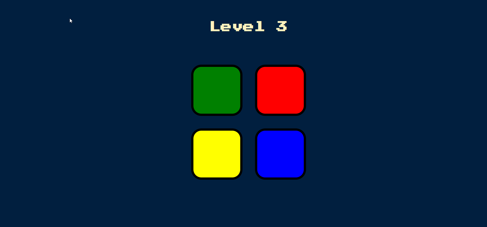

# Simon-Game
Simon is an electronic game of memory skill invented by Ralph H. Baer and Howard J. Morrison, working for toy design firm Marvin Glass and Associates, with software programming by Lenny Cope. In this Repo I have implemented the SIMON game using the fundamentals of jQuery. 

